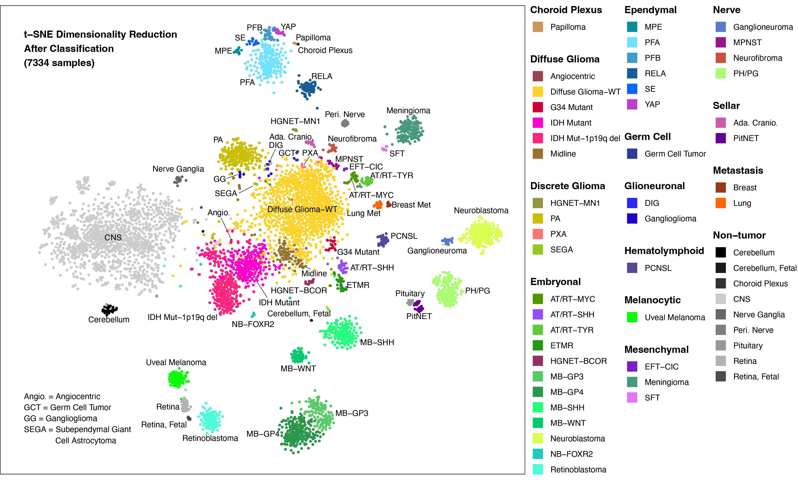

# A Clinically Annotated Transcriptomic Atlas of Nervous System Tumors
In this study, we present an atlas that combines harmonized gene expression and manually curated clinical data from 5,402 neoplastic and 1,973 non-neoplastic nervous system samples from the public domain. Currently, there is a lack of comprehensive atlases covering a broad range of nervous system neoplasm diagnoses, including rarely studied entities, and spanning different geographic regions and age groups. They enable discoveries through comprehensive and robust comparative gene expression analyses across the diagnostic spectrum of nervous system neoplasms. Additionally, we demonstrate that the diagnostic distinctiveness of bulk DNA methylation signatures also extends to gene expression across the diagnostic spectrum of nervous system neoplasms and age groups. In the process, we identified specific entities within discrete gliomas that require further diagnostic refinement. Finally, the methods of this study can be applied to integrate and harmonize raw transcriptomic data from other rare conditions, enhancing their utility.

     

## Instructions
### Gene Expression Data
The ExpData.rds files (zipped and segmented into 11 files) in the Gene Expression Folder contains the gene expression data for each sample. Once downloaded and unzipped, the file (and its data) can be loaded into R with the following simple command. 

ExpData<-read.RDS(“ExpData.rds”) #this will load a data frame.

### Clinical Data
The clinical data associated with the samples are available in Atlas_Data.csv.

VARIABLES:
Filename, Dataset ID, Sample ID, Primary Institution, Country, Tissue preparation

TUMOR DATA:
Original histology, Subgroup Information, Original location, Compartment, Location, Grade, Final diagnosis, and Genetic Information: 1p/19q-codel, IDH1/2 mutation, H3 mutation, TERT (promoter) mutation, EGFR amplification, MGMT promoter methylation, BRAF mutation, MCYN amplification

ANALYSIS RESULTS:
tsne1, tsne2, Diagnosis predicted by the Random Forest, LightGBM, Euclidean, and t-SNE classifiers	

PATIENT DATA:
Stage Neuroblastoma, Stage Medulloblastoma, Age (year), Age (grouped), Sex, Recurrent?, Vital status, Overall survival

## Reproducibilty
All the code files needed to reproduce the results and figures in the original manuscript are available in the R code folder above.